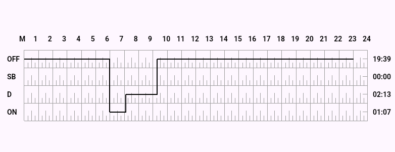

# flutter_eld_graph

`flutter_eld_graph` is a Flutter package designed to easily integrate and visualize graphs, including support for ELD (Elder) graphs. This package provides intuitive and customizable graphing solutions for your Flutter applications.

## Features

- **Graph Generation**: Quickly create and render various types of graphs.
- **Customizable Styles**: Supports a variety of styling options for nodes, edges, and labels.
- **Interactive**: Includes touch and drag interactions for easy navigation and manipulation.
- **Optimized for Performance**: Efficient rendering even for large and complex graphs.


## UI View



## Installation

To install the `flutter_eld_graph` package, add the following dependency to your `pubspec.yaml` file:

```yaml
dependencies:
  flutter_eld_graph: ^<latest_version>
```
## Graph Widget

These are the following attributes of the `GraphWidget` class::

- `dataPoints` - data points is the list of start time ,end time and duty type.
- `[logsDate]` - Date to show on the graph.
- `[axisColor]` - axisColor is the color of the axis.
- `[labelTextStyle]` - labelTextStyle is the text style of the labels.
- `[graphLineColor]` - graphLineColor is the color of the graph line.

## Graph Widget


```sh
 @override
  Widget build(BuildContext context) {
    return Scaffold(
      appBar: AppBar(title: Text("Flutter ELD Graph Demo")),
      body: Center(child: Padding(
        padding: const EdgeInsets.symmetric(horizontal: 60.0),
        child: ELdGraph(dataPoints: eldLogList, logsDate: DateTime.now(),),
      )),

    );
  }
```


